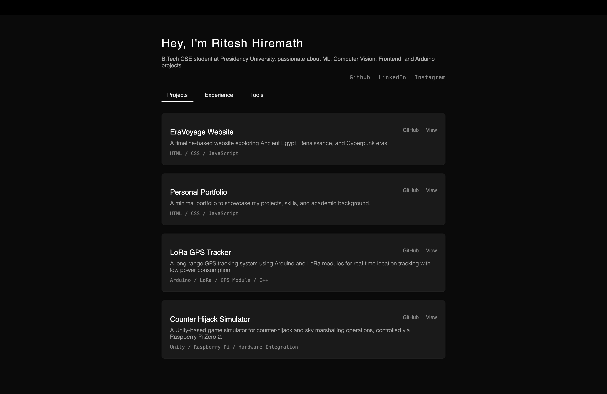

# 🌐 Personal Portfolio - Ritesh Hiremath

Welcome to my personal portfolio website! This project is built to showcase my academic journey, technical projects, tools I work with, and internship experiences — all in a clean and minimal UI.

## 🧑‍💻 About Me

I'm Ritesh Hiremath, a B.Tech CSE student at Presidency University passionate about:

- 🧠 Machine Learning
- 👁️‍🗨️ Computer Vision
- 💡 Frontend Development
- 📡 Arduino & Embedded Systems

---

## 📁 Features

- ⚡ Responsive layout for desktop and mobile
- 🗂️ Project showcase with interactive animations
- 🧰 Tools section with Devicon-powered icons
- 🧭 Tabbed navigation for easy access
- 🎯 Subtle animations on hover and load

---

## 🚀 Live Preview

👉 [Link to the live site](https://portfolio-html-indol.vercel.app/)  

---

## 🛠️ Built With

- **HTML5**
- **CSS3**
- **JavaScript (ES6)**
- **Devicon** for tool icons
- **Geist Sans & Geist Mono** fonts from Vercel

---

## 📸 Screenshots

  

---

## 📂 Folder Structure

📁 personal-portfolio  
├─ 📄 index.html  
├─ 🎨 style.css  
├─ 🧠 script.js  
├─ 📁 assests  
│  └─ 🖼️ screenshot.png  
└─ 📄 README.md

